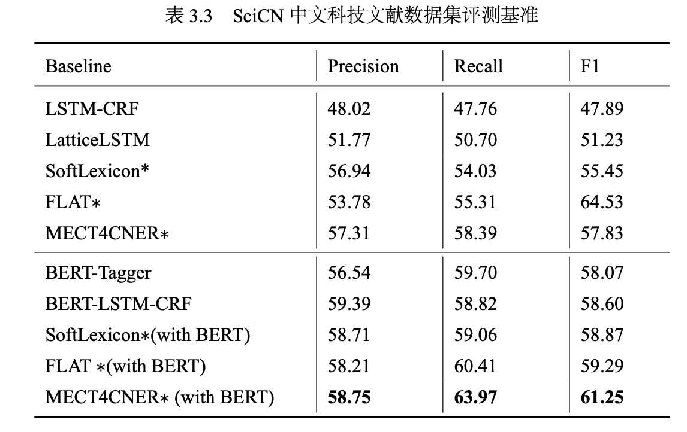
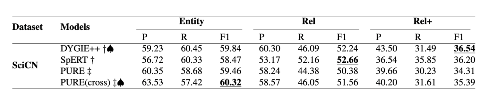
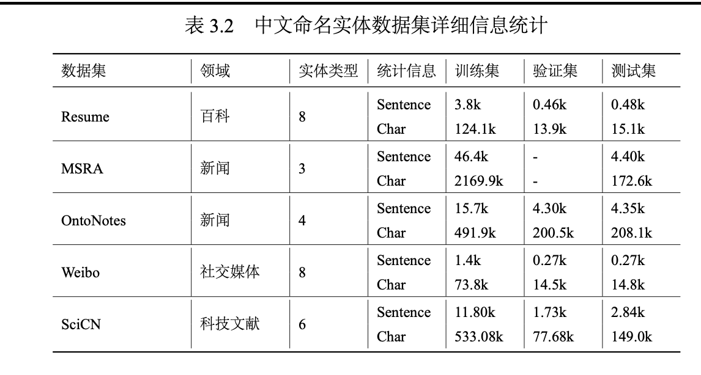

# SciCN: A Chinese Dataset&Benchmark for Scientific Information Extraction 

# Introduction

# Demo

# Benchmark

<!-- 

<image src="./figure/jourals.jpg"  width="300"  height="300" >
<image src="./figure/types.jpg"  width="300"  height="300" >

 -->

# Dataset

# Lexicon
-  [百度网盘提取码: jmoq ](https://pan.baidu.com/s/1jw9ZVfceJEgnRkftUE0i7A?pwd=jmoq) 
    - 300dim
    - 100dim
- [googleCloude link]

